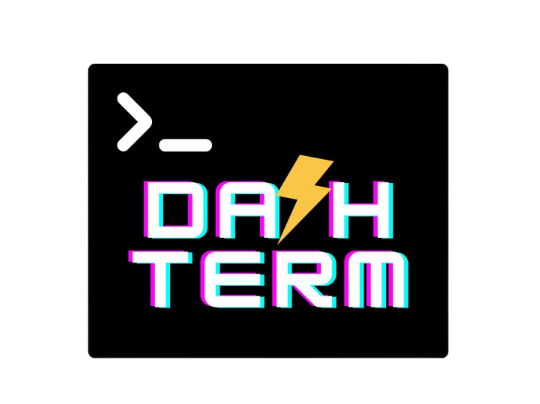

# Da⚡hTerm
>A terminal based application (TUI) for enhancing your productive workstation 👨‍💻...



DashTerm is an easy to use , open-source TUI dashboard which enables you to view all the essential data you need at your workplace in a single glance.

#### What's the app actually doing ? 🤔
This app helps you in marking your events throughout the day, jotting down tasks, tracking down habits, logging journals and time-boxing work with pomo sessions - all enhancing your overall productivity with lightning speed ⚡
And all this information is constantly synced with your cloud services ! 

#### Why use a TUI for this? 🤔
TUI is one of the most frictionless ways to interact with data without getting involved in UI/UX traps.
Over time, it becomes more efficient for inputting or viewing high frequency datapoints.


#### Want to contribute ?
Please refer to the [Contributing Section](#contributing-) 
Thanks in advance <3


## Features 📑

Not an exaustive list - many more dashboard views are yet to come !

Some of the currently planned **dashboard views** are : 
- 📆 Google calendar
  - View , edit and modify your daily events
- ✅ Google tasks
  - View, edit and modify your tasks from any task lists
- 🎯 Habitica - Habit Tracking
  - Manage and track your dailies and habits synced with [Habitica](https://habitica.com/)
- 📒 Google Keep
  - View and add your journalling notes to Google keep 
- ⏲ Pomodoro
  - View and start-pause-stop pomodoro sessions 


## How to use this ⚙?
#### Requirements
- python3
- pip or pip3

#### Cloning the repo
```
git clone https://github.com/Akash-Sharma-1/DashTerm.git
```
#### Installing Dependencies
```
cd DashTerm

pip install -r requirements.txt
```
#### Firing up the terminal
```
python tui.py
```
- Use Windows Terminal for the best experience


## This is a **work-in-progress** project 😊

The project currently is divided in 2 milestones : **Phase 1** and **Phase 2**
- Phase 1 is the milestone where the plan is construct robust implementations for the currently planned basic features.
- Phase 2 is the milestone where the plan is extend the tool to integrate more plugins and make it more user friendly

There are a few todo items left for the Phase 1 - you can view it in the [Projects](https://github.com/users/Akash-Sharma-1/projects/1/views/1) section.
All issues are tagged with Phase 1 and Phase 2 depending upon the severity and nature.

## Contributing ♥

Currently, there are very few limited applications in the market, that could provide a single glance view of all the essential components of a work management system for a developer. 

The definition of a work management system itself varies quite differently across devs, orgs and groups.
>*DashTerm could become a personalised plug-play TUI tool for everyone to manage their work effectively and enhance their productivity with plugins they feel empowered with .* 

Achieving this humoungous task, is only a possiblity with your contributions to this project through bug reporting, proposing enhacements, documenting, code contributing and much more.

## License 

This project is licensed under the MIT License - see the [LICENSE](LICENSE) file for details